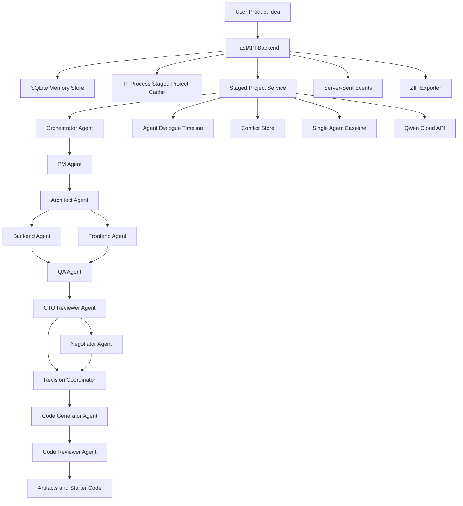

# DevTeam AI Architecture

## Agent roles

| Agent | Responsibility |
|---|---|
| Orchestrator Agent | Decomposes the request, assigns roles, and defines dependencies |
| PM Agent | Requirements, users, MVP scope, acceptance criteria |
| Architect Agent | Architecture, services, data flow, security, deployment |
| Backend Agent | APIs, database schema, events, business rules |
| Frontend Agent | Stack selection, screens/pages, navigation, state management, offline plan |
| QA Agent | Acceptance, negative, integration, performance, security tests |
| CTO Agent | Challenges contradictions, missing requirements, frontend/backend mismatches, risks, and MVP bloat |
| Negotiator Agent | Resolves disagreements and produces ADR-style decision records |
| Revision Coordinator | Applies CTO and negotiation findings into a concise revision plan |
| Code Generator Agent | Generates approved starter scaffold files |
| Code Reviewer Agent | Reviews generated code for missing files, security gaps, and API mismatches |

## Why it is multi-agent

The primary workflow is stage-based. The Orchestrator decomposes the request first, then each specialist stage unlocks only after dependencies are approved. Agent dialogue is stored as a timeline so proposals, challenges, disagreements, resolutions, and revision requests are visible. The CTO Agent detects conflicts, the Negotiator Agent resolves open disagreements, and the Revision Coordinator summarizes accepted changes before code generation can run.

The staged service keeps active project state in process memory for demo responsiveness and mirrors staged project summaries to SQLite for history. The legacy quick-run workflow still persists completed projects in SQLite. Both staged and legacy projects can be exported as ZIP artifacts.

## Primary staged endpoints

- `POST /projects`
- `GET /projects`
- `GET /projects/{project_id}`
- `GET /projects/{project_id}/state`
- `POST /projects/{project_id}/stages/{stage_name}/run`
- `POST /projects/{project_id}/stages/{stage_name}/run-stream`
- `POST /projects/{project_id}/stages/{stage_name}/approve`
- `POST /projects/{project_id}/stages/{stage_name}/revise`
- `POST /projects/{project_id}/stages/{stage_name}/regenerate`
- `GET /projects/{project_id}/dialogue`
- `GET /projects/{project_id}/conflicts`
- `POST /projects/{project_id}/conflicts/{conflict_id}/resolve`
- `POST /projects/{project_id}/baseline/run`
- `GET /projects/{project_id}/comparison`
- `POST /projects/{project_id}/generate-code`
- `POST /projects/{project_id}/review-code`
- `GET /projects/{project_id}/export.zip`
- `GET /projects/{project_id}/export`
- `GET /memory/search`

## Frontend experience

The Next.js frontend provides:

- Project creation with idea, target users, platform, constraints, and preferred frontend stack.
- A history sidebar for staged and legacy quick-run projects.
- A gated stage stepper that shows dependencies, approval status, and the next runnable stage.
- Stage workspace controls for run, approve, regenerate, and request changes.
- Live Server-Sent Event activity for stage progress.
- Agent dialogue, conflict cards, baseline comparison, generated files, and export actions.

## Current limitations

- Memory is keyword-based SQLite memory, not vector search.
- Agent progress is streamed to the frontend with Server-Sent Events.
- Staged project state is in process memory for MVP demo speed, with staged summaries mirrored to SQLite history.
- Scoring is deterministic demo scoring, not a formal benchmark.
- The backend currently allows all CORS origins for local and hackathon demo use.
